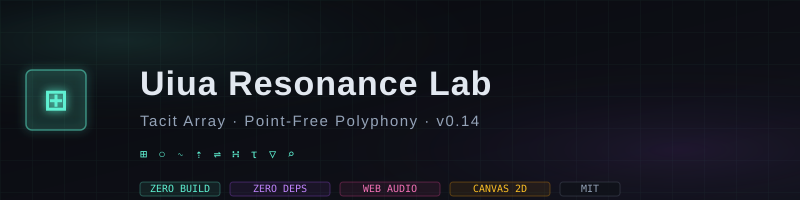

<div align="center">



# Uiua Resonance Lab

**A tacit-array tensor visualizer & polyphonic synthesizer — rendered in a single HTML artifact.**

[](https://github.com/zazieproductions/UIUA-RESONANCE-LAB/releases)
[](LICENSE)
[](#architecture)
[](#architecture)
[](https://developer.mozilla.org/en-US/docs/Web/API/Web_Audio_API)
[](https://developer.mozilla.org/en-US/docs/Web/API/CanvasRenderingContext2D)

[Live Demo](https://zazieproductions.github.io/UIUA-RESONANCE-LAB) · [Documentation](docs/) · [Architecture](docs/ARCHITECTURE.md) · [Glyph Reference](docs/GLYPHS.md) · [Roadmap](docs/ROADMAP.md) · [Contributing](CONTRIBUTING.md)

</div>

---

## Overview

**Uiua Resonance Lab** is an interactive computational artifact that visualizes tensor mathematics and synthesizes harmonic waveforms through the aesthetic lens of [Uiua](https://uiua.org) — a modern, stack-oriented, array-programming language. It is a self-contained web application: no build step, no package manager, no runtime dependencies. A single `index.html` orchestrates a real-time 2-D grid renderer, a Web Audio DSP graph, an oscilloscope, a tacit-program buffer, and a stack inspector — all in pure vanilla JavaScript.

The project functions simultaneously as:

- **Creative coding instrument** — an audiovisual playground for interference patterns, golden-ratio bells, toroidal phase fields, and cellular automata.
- **Array-language primer** — a living reference for Uiua's glyphic notation, tacit composition, and point-free semantics.
- **Portfolio-grade engineering artifact** — a case study in zero-dependency systems design, deterministic rendering, and low-footprint interactive media on the web.

```
                    ┌─────────────────────────────────────────┐
                    │        Uiua Resonance Lab v0.14         │
                    │   Tacit Array · Point-Free Polyphony    │
                    └─────────────────────────────────────────┘
                                       │
        ┌──────────────┬───────────────┼───────────────┬──────────────┐
        ▼              ▼               ▼               ▼              ▼
   ┌─────────┐  ┌────────────┐  ┌────────────┐  ┌───────────┐  ┌──────────┐
   │ Preset  │  │ Tacit Code │  │  Tensor    │  │  WebAudio │  │  Stack   │
   │ Engine  │  │   Buffer   │  │  Canvas2D  │  │    DSP    │  │Inspector │
   └─────────┘  └────────────┘  └────────────┘  └───────────┘  └──────────┘
```

---

## Quick Start

### Option 1 — Open Directly
```bash
# Clone and open
git clone https://github.com/zazieproductions/UIUA-RESONANCE-LAB.git
cd UIUA-RESONANCE-LAB
open index.html        # macOS
xdg-open index.html    # Linux
start index.html       # Windows
```

### Option 2 — Local HTTP Server
```bash
# Python 3
python3 -m http.server 8080

# Node (npx)
npx serve .

# Then visit http://localhost:8080
```

> **Note:** The Web Audio API requires a user gesture to initialize on modern browsers. Click **SYNTHESIZE** once the page loads to engage the DSP graph.

### Option 3 — Live Deployment
Push to any static host (GitHub Pages, Netlify, Vercel, Cloudflare Pages, S3+CloudFront). Zero build step required — the `index.html` entrypoint is the complete application.

---

## Features

| Category | Capabilities |
|---|---|
| **Visual Rendering** | Real-time 300×300 tensor field via `Canvas2D`, deterministic colormap pipeline, CRT-scanline overlay, frequency-scaled gridlines |
| **Audio Synthesis** | Procedural wavetable generation, polyphonic harmonic additive synthesis, gain staging, FFT-powered oscilloscope via `AnalyserNode` |
| **Presets** | 4 curated artifacts: Cymatic Lattice, Fibonacci Subharmonic Bells, Phase Toroid Drift, Cellular Dilation Matrix |
| **Tacit Buffer** | Editable glyphic code surface with 24 click-to-insert primitives, hover-documented stack signatures, live stack-state inspector |
| **Parameters** | Live-tunable carrier frequency (55–880 Hz), tensor resolution (24–128), phase-modulation velocity (0.1×–4.0×) |
| **Instrumentation** | FPS counter, FPS-stable `requestAnimationFrame` loop, amplitude meter, matrix-shape indicator |
| **A11y / UX** | Focus-visible interactive controls, keyboard-accessible inputs, high-contrast CRT-on-dark palette, `prefers-reduced-motion`-friendly defaults |

---

## Repository Structure

```
UIUA-RESONANCE-LAB/
├── index.html                  # Complete application (entrypoint)
├── README.md                   # This document
├── LICENSE                     # MIT License
├── CHANGELOG.md                # Version history
├── CONTRIBUTING.md             # Contribution guidelines
├── CODE_OF_CONDUCT.md          # Community covenant
├── SECURITY.md                 # Security policy & disclosures
├── .gitignore                  # Git ignore rules
├── .github/
│   └── ISSUE_TEMPLATE/
│       ├── bug_report.md       # Bug report template
│       └── feature_request.md  # Feature request template
└── docs/
    ├── ARCHITECTURE.md         # System design & data flow
    ├── API.md                  # Internal module API reference
    ├── GLYPHS.md               # Uiua glyph dictionary (24 primitives)
    ├── PRESETS.md              # Preset artifact deep-dives
    ├── AUDIO.md                # DSP & synthesis pipeline
    ├── PERFORMANCE.md          # Framerate, memory & rendering budget
    ├── ACCESSIBILITY.md        # WCAG compliance & UX considerations
    ├── TESTING.md              # Testing strategy & manual checklist
    ├── DEPLOYMENT.md           # Deployment targets & CI/CD
    ├── ROADMAP.md              # Forward-looking plan
    └── assets/                 # Diagrams, banners, imagery
```

---

## Tech Stack

| Layer | Technology | Rationale |
|---|---|---|
| **Markup** | Semantic HTML5 | No framework overhead; SEO-a11y friendly |
| **Styling** | Tailwind CSS (CDN) + CSS custom properties | Rapid UI iteration; explicit design tokens for the dark "tacit-ink" palette |
| **Typography** | Space Grotesk (display) · Fira Code (mono) | Distinguished editorial feel; unambiguous glyph rendering |
| **Rendering** | Canvas 2D API | Immediate-mode rasterization ideal for per-cell tensor fields |
| **Audio** | Web Audio API (`AudioContext`, `AnalyserNode`, `BufferSource`) | Native low-latency DSP; no external audio library needed |
| **Runtime** | Vanilla ES2020+ JavaScript | Zero dependencies, zero build, instant load |

---

## Documentation Index

| Document | Purpose |
|---|---|
| [Architecture](docs/ARCHITECTURE.md) | System diagram, module boundaries, data flow, rendering pipeline, state model |
| [API Reference](docs/API.md) | Internal function contracts, preset interface, render/synth signatures |
| [Glyph Dictionary](docs/GLYPHS.md) | All 24 Uiua primitives with stack signatures, arity, and category |
| [Preset Catalog](docs/PRESETS.md) | Mathematical breakdown of each artifact, waveform topology, visual topology |
| [Audio Pipeline](docs/AUDIO.md) | Wavetable synthesis, additive harmonics, gain staging, oscilloscope |
| [Performance](docs/PERFORMANCE.md) | Frame budget, memory profile, scaling characteristics, optimization notes |
| [Accessibility](docs/ACCESSIBILITY.md) | WCAG 2.2 AA alignment, keyboard navigation, color contrast, reduced motion |
| [Testing](docs/TESTING.md) | Manual verification checklist, browser matrix, regression protocol |
| [Deployment](docs/DEPLOYMENT.md) | Static hosting, GitHub Pages workflow, CDN, cache strategy |
| [Roadmap](docs/ROADMAP.md) | Versioned future work, milestones, open research questions |
| [Changelog](CHANGELOG.md) | Per-release diff of features, fixes, and breaking changes |

---

## Design Philosophy

Three principles anchor every engineering decision in this project:

1. **Tacit by design.** Just as Uiua eliminates named variables in favor of stack composition, the application architecture eliminates incidental complexity — no frameworks, no bundlers, no abstraction tax. The source *is* the build.

2. **Arrays as first-class citizens.** The visual field, the audio buffer, and the glyph palette are all modeled as immutable arrays processed by pure functions. Rendering and synthesis derive from the same mathematical substrate.

3. **Single-artifact portability.** `index.html` is the entire program. It loads from any `file://` context, survives offline, deploys to any static host, and can be emailed, archived, or embedded without dependency management.

---

## Contributing

Contributions are welcome — from glyph additions and preset patches to accessibility improvements and documentation refinements. Please read [CONTRIBUTING.md](CONTRIBUTING.md) for the development workflow, coding conventions, and pull-request process.

Not sure where to start? See the [good-first-issue](https://github.com/zazieproductions/UIUA-RESONANCE-LAB/labels/good%20first%20issue) label or review the [Roadmap](docs/ROADMAP.md).

---

## Credits & Acknowledgments

- Built as a creative homage to [**Uiua**](https://uiua.org) by Kai Schmidt — the array language that inspired this interface's glyphic vocabulary and tacit philosophy.
- Visual language draws from Chladni-plate cymatics, Clifford-torus topology, and the golden-ratio harmonic series.
- DSP topology inspired by classic analog additive synthesis and wavetable techniques.

---

## License

Released under the [MIT License](LICENSE). © 2025 Zazie Productions.

<div align="center">

```
⊞ ○ ∿ ⇡ ⇌ ∺ τ ▽ ⌕
 tacit · array · resonance
```

</div>
